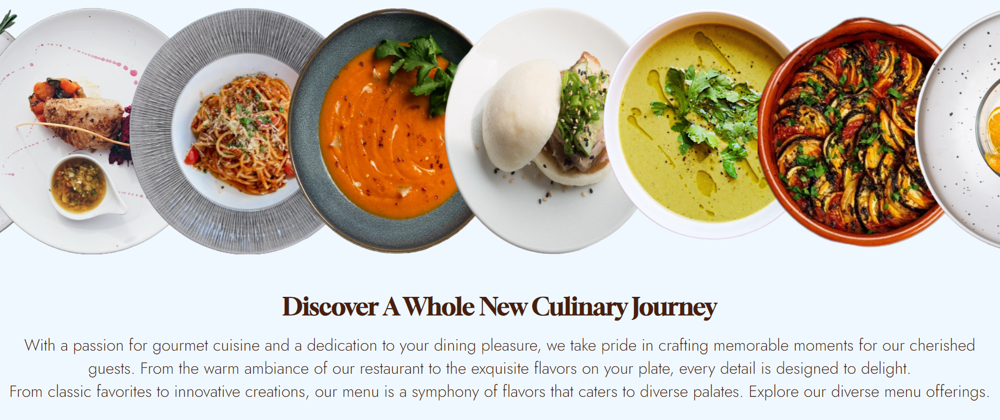
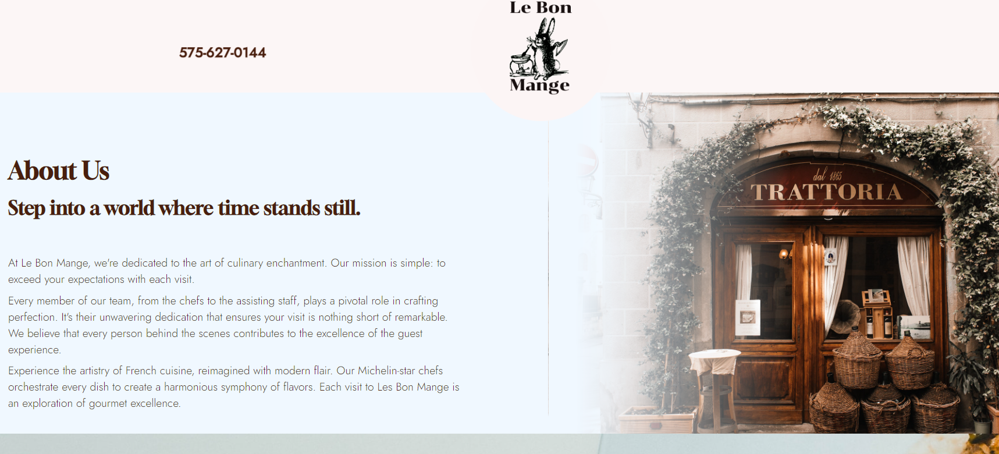
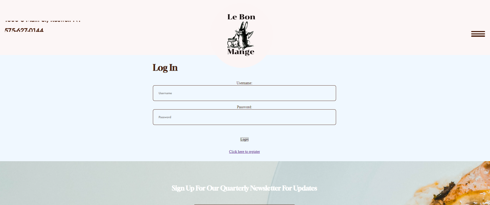
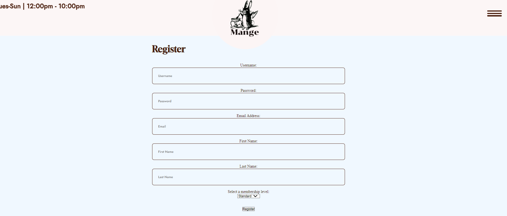

# Le Bon Mange

[](https://opensource.org/licenses/MIT)

Le Bon Manges is a web application that offers an elegant and convenient way for users to explore a sophisticated restaurant's offerings, join the restaurant membership for perks, and stay updated with the latest news and events. Whether you're a food enthusiast, a restaurant connoisseur, or simply looking for a memorable dining experience, Le Bon Manges has you covered.

## Table of Contents

- [Key Features](#key-features)
- [Getting Started](#getting-started)
  - [Prerequisites](#prerequisites)
  - [Installation](#installation)
- [Usage](#usage)
  - [Configuration](#configuration)
- [Features](#features)
- [Screenshots](#screenshots)
- [Contributing](#contributing)
- [License](#license)
- [Contact](#contact)


## Key Features

- **Menu Exploration:** Browse through our meticulously crafted menu, featuring a wide array of culinary delights, each prepared to perfection.

- **Login & Register Pages:** Save user data by creating an account for future membership perks & newsletter development.

- **About Us:** Get to know the story behind Le Bon Manges, our commitment to quality, and our dedication to creating unforgettable moments.

- **Contact Us:** Have questions or feedback? Reach out to us through our contact form, and our friendly staff will assist you promptly.

- **Reservations:** Reach out to us through our reservation form, and our friendly staff will assist you promptly.

## Getting Started

Follow these instructions to get a copy of the project up and running on your local machine for development and testing purposes.

*Prerequisites*

Before you begin, ensure you have met the following requirements:

- Node.js and npm installed on your local machine.
- Git installed on your local machine.

*Installation & Usage*

1. CLone the repository to your local machine:

```
git clone git@github.com:LarryByrd89/gusteaus-restaurant.git
```
2. Change to the project's directory:


```
cd your-repo
```

3. Install the server dependencies:

```
cd server
npm install
```

4. Install client dependencies:

```
cd ../client
npm install
```

5. Start the development server

```
npm run develop
```

## Screenshots

- Home Page



- About page



- Menu Page


- Register & Login



- Newsletter Footer


- Date Picker for Reservations


## Contributing

If you would like to contribute as a developer, you can submit a pull request.

## Asset Credits

### Unsplash

[Patrick Brown @goosepicklefire](https://unsplash.com/@goosepicklefire)

[Martin Windenka @widenka](https://unsplash.com/@widenka)

[Max Griss @grissphoto](https://unsplash.com/@grissphoto)

[Cesira Alvarado](https://unsplash.com/photos/tNkoH1d1uz8)

[Megan Bucknall @meganmarkham](https://unsplash.com/photos/qav5LFLbSUk)

[Jay Wennington @jaywennington](https://unsplash.com/@jaywennington)

### Pixabay

[guillermomuro00](https://pixabay.com/users/guillermomuro00-12807863/)

[Rabbit Logo](https://pixabay.com/vectors/rabbit-cooking-food-kitchen-animal-41119/)

[StackOverflowv- Hamburger React JS](https://stackoverflow.com/questions/70310465/how-can-i-close-my-hamburger-menu-when-clicking-on-a-link-using-react-js-using)

[CodePen](https://codepen.io/)

[npmjs.com](https://docs.npmjs.com/)